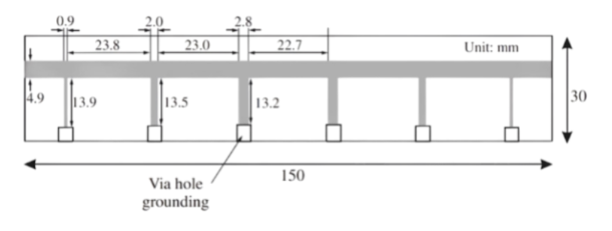
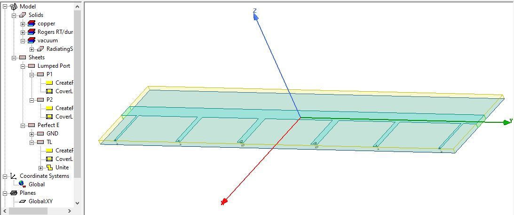
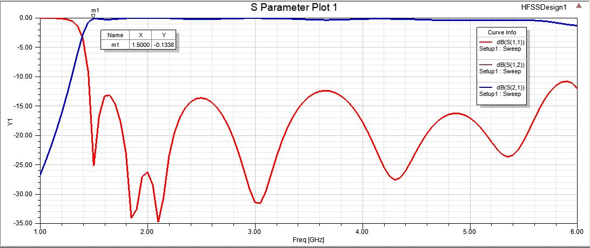
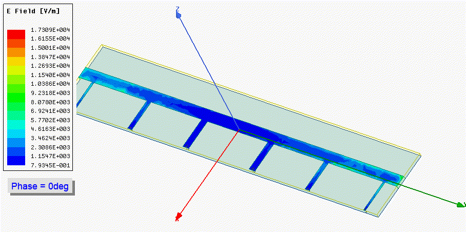

# Microstrip High-Pass Filter Simulation Repository

## Repository Structure

```
Microstrip-High-Pass-Filter-Simulation/
├── .gitignore
├── README.md
├── docs/
│   ├── geometry_screenshots/
│   │   ├── Microstrip_stricture.png
│   │   ├── Microstrip_High_Pass_Model.JPG
│   └── animation/
│       ├──  efield_animation.avi
│       ├── EField_Animaion.gif
├── hfss_project/
│   ├── Microstrip_High_Pass_Filter_Divyam.aedt
│   ├── Microstrip_High_Pass_Filter_Divyam.aedt.lock            
├── results/
│   ├── HighPass_filter_Microstrip_Analysis.JPG
│   ├── EF_field_effect.JPG

```

# Microstrip High-Pass Filter Simulation

### Introduction to Microstrip
A **microstrip** is a type of electrical transmission line commonly used to
convey microwave-frequency signals. It consists of a conductive strip placed on top of a dielectric substrate, with a ground plane on the bottom
side. Due to its compact and planar structure, it is widely implemented in
high-frequency circuits such as Antennas, Filters, Couplers, Power Dividers, Amplifiers etc.
### Advantages of Microstrip:
- Compact and Lightweight – Suitable for PCB integration.
- Low-Cost Fabrication – Easily manufactured using standard PCB
etching methods.
- Ideal for RF/Microwave Applications – Excellent for high-frequency
performance.

### Understanding S-Parameters
Scattering parameters (S-parameters) are a set of complex
frequency-dependent values that characterize how RF signals behave in a
multi-port network. They represent how energy is reflected and transmitted
across ports.

- **S11 (Input Reflection Coefficient):** Measures how much power is
reflected back into Port 1.
- **S21 (Forward Transmission Coefficient):** Indicates how much power
is transmitted from Port 1 to Port 2. 
- **S12 (Reverse Transmission Coefficient):** Power transmission from
Port 2 to Port 1.
- **S22 (Output Reflection Coefficient):** Reflects how much power is
reflected back into Port 2. 

### 1. Geometry Creation

1. **Substrate**  
   - Modeled as a cuboid of Rogers RT/duroid 5880 (εr = 2.2)  
2. **Transmission Line**  
   - Main strip drawn via Rectangle tool  
3. **Resonators**  
   - Microstrip stubs attached along the line for filtering; grouped with Unite  
4. **Vias**  
   - Cylinders connecting the top strip to the bottom ground plane  


### 2. Port and Boundary Setup
- **Lumped Ports**  
  - Port 1 at the input end; Port 2 at the output end 
- **Perfect E Boundaries**  
  - Assigned to all conductor faces to enforce ideal metallic behavior  

### 3. Simulation Environment
- **Open Region**  
  - Surrounding air region to allow free-space radiation  
- **Frequency Sweep**  
  - Linear sweep from 1 GHz to 6 GHz 
- **Solution Setup**  
  - Driven-modal solver at 1.5 GHz, adaptive mesh with maximum ΔS = 0.02


### Results and Observations



| Observation             | Result/Interpretation                                                                                       |
|-------------------------|------------------------------------------------------------------------------------------------------------|
| **S21 & S12 Overlap**   | The S21 and S12 curves overlapped, confirming the **symmetrical nature** of the microstrip filter.         |
| **High-Pass Behavior**  | The filter exhibits a **sharp cutoff near 1.5 GHz**, consistent with theoretical predictions.              |
| **Low S11 & S22 in Passband** | Both S11 and S22 are **low in the passband**, indicating efficient power transmission and minimal reflection losses. |

These results validate the design and simulation, demonstrating that the filter meets key expectations for symmetry, cutoff frequency, and low loss within the operational band.

### E-Field Animation
An animation of the E-field distribution at 1.5 GHz illustrates field confinement and stub resonance.  
`docs/animation/efield_animation.avi`



## Getting Started

1. **Clone**  
   ```bash
   git clone https://github.com/DivyamGoyal-github/Microstrip-High-Pass-Filter-ANSYS-HFSS-Simulation.git
   cd hfss_project
   ```
2. **Open Project**  
   - Launch Ansys Electronics Desktop and navigate to `hfss_project/Microstrip_High_Pass_Filter_Divyam.aedt`.  
   - Ensure all model parameters and material assignments are correct as per the design requirements.

3. **Run Simulation**  
   - Use the pre-configured Driven-Modal analysis setup for the microstrip high-pass filter.  
   - Start the simulation, monitoring mesh generation and solver progress for any errors or warnings.  
   - Upon completion, the simulated data (S-parameters, field distributions, etc.) will be automatically exported to the `results/` directory for further analysis.

4. **View Results**  
   - **Plots & Reports:**  
     - Look in the `results/` folder for S-parameter plots (e.g., S11, S21 vs. frequency), which provide insight into filter performance, such as cutoff frequency and insertion loss.  
   - **Screenshots:**  
     - Explore `docs/geometry_screenshots/` for images of the simulated geometry, setup boundaries, and mesh details that document your simulation configuration.  
   - **Animations:**  
     - For dynamic field visualizations, access `docs/animation/` where you’ll find exported animations (such as evolving electric/magnetic fields) illustrating how the filter behaves under excitation across the frequency range.
